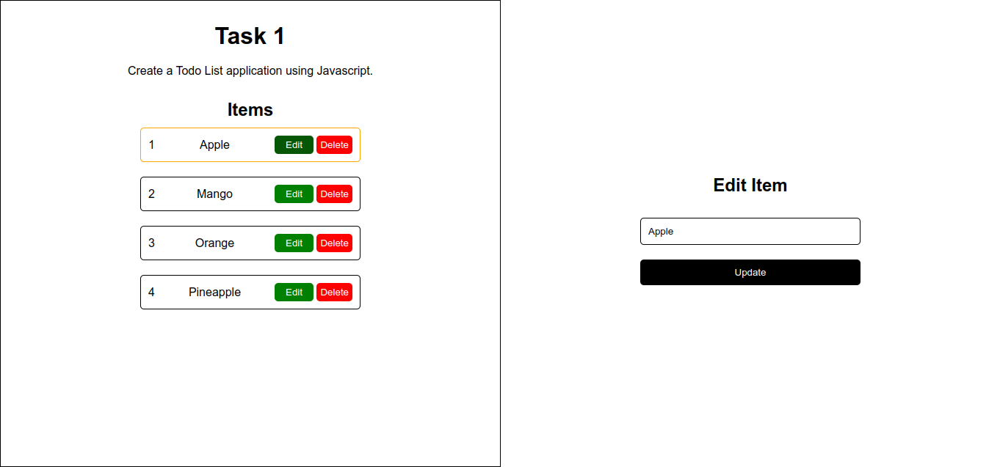

# Learning Track Task 2: Todo List With Typescript

This is a ToDo web application built with HTML, SCSS, and Typescript.

## Features

- Add new tasks
- Edit existing tasks
- Delete tasks
- List all tasks

### Image




### Clone the Repository

1. Open your terminal or command prompt.
2. Clone the repository to your local machine using the following command:

   ```sh
   git clone https://github.com/ephyg/Learning-Track-Tasks.git

3. Navigate to the project directory:

   ```sh
   cd Learning-Track-Tasks/task-2

4. Open index.html file and open it in your browser.