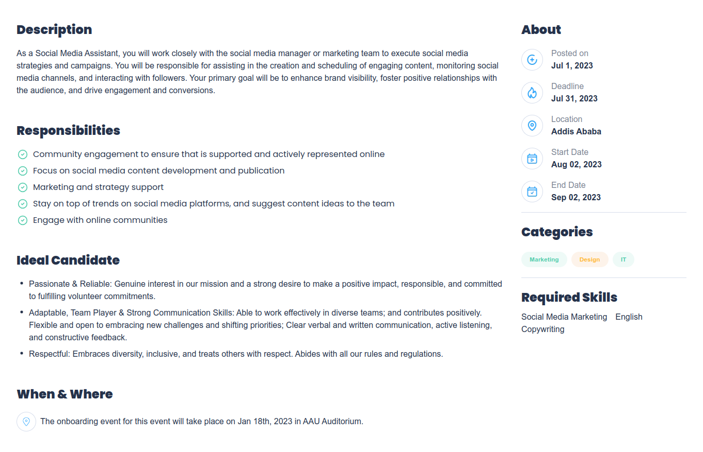

# Learning Track Task 6: Implement Figma Design with Tailwind CSS and next.js


## Task Description

Implement the figma design using tailwind CSS. The figma design is a job listing page with a job detail page. The job listing page contains a list of jobs with the job title, company name, location, and job type. The job detail page contains the job title, company name, location, job type, job description and more.

## Guidelines setup the project

1. clone the repository using the following command

```bash
git clone https://github.com/ephyg/Learning-Track-Tasks.git
```
2. Navigate to the `task-6: Implement-figma-with-tailwind` directory using the following command:

```bash
cd task-6: Implement-figma-with-tailwind
```
3. Install the dependencies using the following command:

```bash
npm install
```
4. Start the development server using the following command:

```bash
npm run dev
```
5. Open your browser and navigate to `http://localhost:3000/` to view the application


## screenshots of the website



