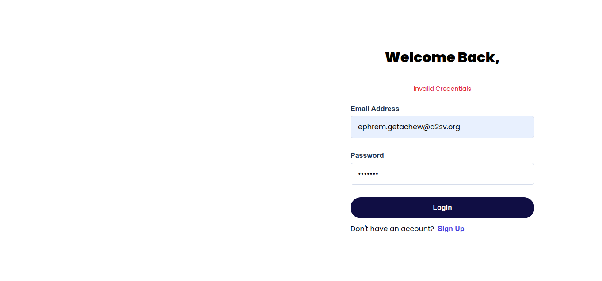

# Learning Track Task 8: NextAuth


## Task Description
Implementation of Authentication using NextAuth 


## Guidelines setup the project

1. clone the repository using the following command

```bash
git clone https://github.com/ephyg/Learning-Track-Tasks.git
```
2. Navigate to the task 6 directory using the following command:

```bash
cd Learning-Track-Tasks/integrating-api-data
```

3. Install the dependencies using the following command:

```bash
npm install
```
4. Start the development server using the following command:

```bash
npm run dev
```
5. Open your browser and navigate to `http://localhost:3000/` to view the application


## screenshots of the website





